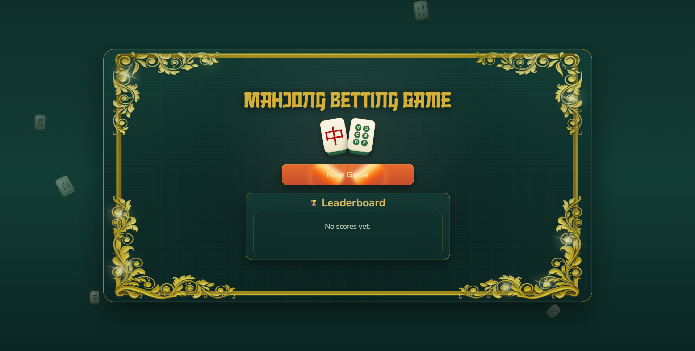
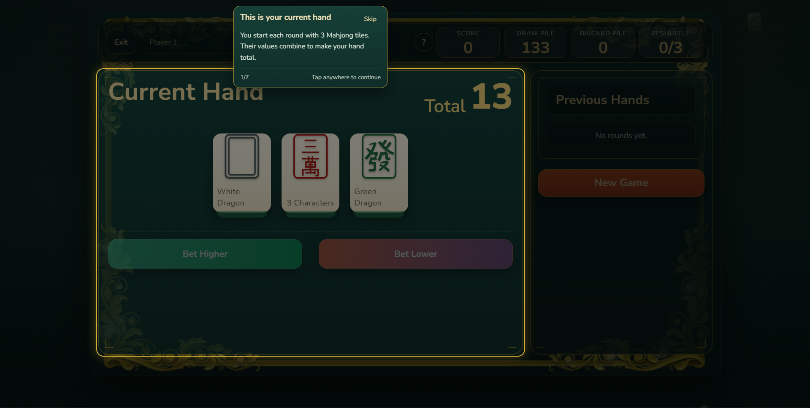
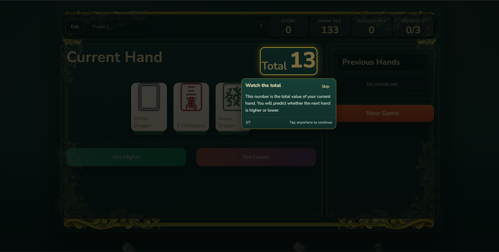
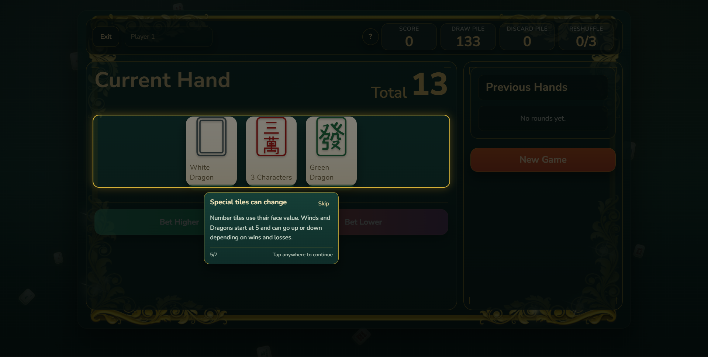
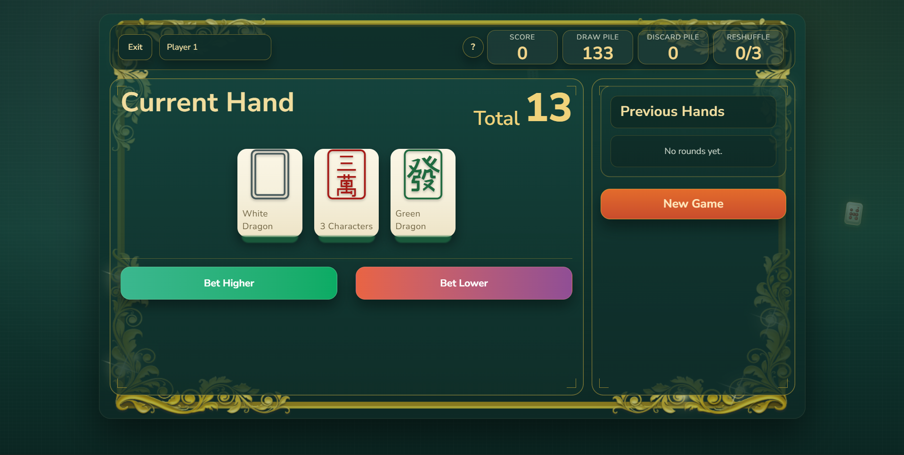
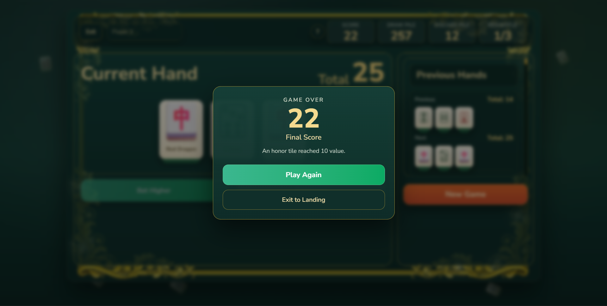

# 🀄 Mahjong Hand Betting Game

A web-based Mahjong-themed betting game built with **React, TypeScript, and Vite**.  
The game focuses on strategic prediction, dynamic tile values, and clean, scalable architecture.

---

## 🎮 Game Preview

### 🏠 Landing Page


### 🎯 Gameplay Screen








### 📊 End Screen


---

## 🧠 Game Objective

Predict whether the **next 3-tile hand** will have a **higher or lower total value** than the current hand.

Each correct prediction increases your score.

---

## ⚙️ Core Game Rules

### 🎴 Tile Types

- **Number Tiles (1–9)** → Face value  
- **Honor Tiles (Winds & Dragons)** → Start at value **5**

---

### 🔄 Dynamic Honor Scaling

After each round:

- Winning hand → Honor tile value **+1**
- Losing hand → Honor tile value **−1**
- Values are bounded between **0 and 10**

👉 Scaling is applied **per tile type (not per occurrence)**

---

### 🎲 Betting System

- Bet **Higher** → next hand total should be greater  
- Bet **Lower** → next hand total should be smaller  
- **Tie = Loss**

---

### 🔁 Deck & Reshuffle Logic

- Uses full Mahjong tile set  
- Draw + Discard piles maintained  

When draw pile is insufficient:

1. Create fresh deck  
2. Combine with discard pile  
3. Shuffle into new draw pile  
4. Increment reshuffle count  

---

### 🛑 Game Over Conditions

Game ends when:

- Any honor tile reaches **0 or 10**
- Deck reshuffled **3 times**

---

## ✨ Features

### 🎮 Gameplay

- Smooth **Higher/Lower betting loop**
- **3-tile hands**
- Dynamic tile value system

---

### 📊 History Panel

- Displays full round history
- Each entry includes:
  - Previous hand
  - Next hand
  - Bet
  - Result

---

### 🏆 Leaderboard

- Top 5 high scores
- Stored in **localStorage**
- Sorted in descending order

---

### 🎓 Interactive Walkthrough

- First-time user tutorial
- Step-by-step explanation:
  - current hand
  - total value
  - betting system
  - history panel
  - honor tile behavior
- Supports:
  - next step
  - skip
  - replay

---

### 🎨 UI & Experience

- Mahjong-themed UI
- Animated interactions
- Responsive design
- Smooth transitions

---

## 🧱 Architecture

The project is designed for **scalability and extension**.


```
└── src/
    ├── app/            # Main application component and view controller
    ├── components/     # Reusable React components for screens, UI elements, and the tutorial
    ├── data/           # Static data for the tutorial steps
    ├── game/           # Core game logic, decoupled from the UI
    │   ├── engine/     # Deck management, honor scaling, game over rules, and state reducer
    │   └── models/     # TypeScript type definitions for all game entities
    ├── hooks/          # Custom hooks for managing the game session and walkthrough state
    └── services/       # Services for interacting with browser APIs, like localStorage for the leaderboard
```

### Key Principles

- Separation of **UI and game logic**
- Reducer-driven state management
- Modular, feature-ready structure

---

## 🚀 Getting Started

### 1. Clone Repository

```bash
git clone https://github.com/prathamrathore123/mahjongbettinggame.git
cd mahjongbettinggame
2. Install Dependencies
npm install
3. Run Development Server
npm run dev

App will run at:
👉 http://localhost:5173

📦 Build
npm run build
🧪 Scripts
npm run dev → Start dev server
npm run build → Production build
npm run preview → Preview build
npm run lint → Lint code
🤖 AI Usage Disclosure

AI tools (including Codex/ChatGPT) were used to:

assist with UI ideation
refine animations and UX flows
improve documentation structure

All core game logic, architecture decisions, and final implementation were reviewed, modified, and validated manually.

🎯 Assessment Alignment

This project fully implements:

Mahjong tile system (numbers + honors)
Dynamic honor value scaling
Higher/Lower betting system
Deck + discard + reshuffle pipeline
Game over conditions
Full history tracking
Interactive walkthrough
Persistent leaderboard

The architecture is designed to support future feature extensions, as required in the assessment.

📌 Notes
Tie is treated as a loss for consistent gameplay
Honor scaling is applied per tile type (not per duplicate count)
Reshuffle logic is deterministic and bounded
📬 Submission
GitHub Repository ✔️
README Documentation ✔️
Gameplay Demo Video (to be attached)
👨‍💻 Author

Pratham Rathore
Full Stack Developer

🔗 LinkedIn

📧 prathamrathore2003@gmail.com

⭐ Final Thought

This project focuses not just on gameplay, but on clean architecture, scalability, and user experience, making it ready for extension and real-world use.


---

# 🎯 What you need to do now

### 1. Add images
Put images in:

docs/image/


Rename them exactly:
- `landing.png`
- `gameplay.png`
- `end.png`

---

### 2. Push changes
```bash
git add .
git commit -m "Enhanced README with images and assessment alignment"
git push
